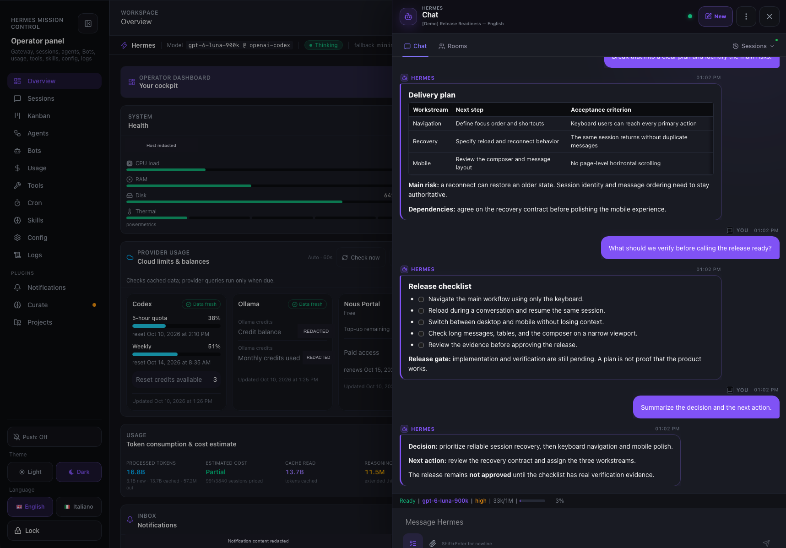
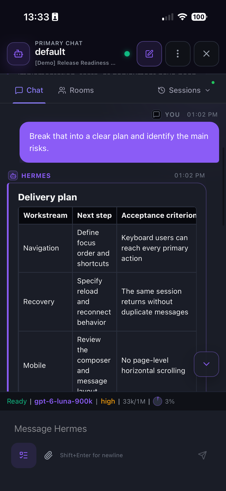

# Chat

Mission Control includes an **expanded Chat** that talks directly to the Hermes gateway over a WebSocket — not to a separate backend. It streams reasoning, tools, and the final response live, keeps a per-session presence pill in sync, and links the active conversation to a tldraw whiteboard (see [tldraw Agent Mode](tldraw-feature-matrix.md)).

## In action



*A resumed planning conversation with a structured delivery plan, release checklist, and next action. The full desktop workspace is preserved; private machine and account details are redacted.*

<details>
<summary>The same session on mobile</summary>

<p align="center">
  <a href="screenshots/chat-mobile.webp"></a>
</p>

*The same saved session on mobile. The table wraps within the narrower viewport; desktop and mobile are shown at different scroll positions.*

</details>

The conversation is a prepared, saved demo transcript. It illustrates the session and responsive UI, not a completed implementation or a tool-execution trace.

## Architecture

```
React Chat UI (ChatDrawer / chat-messages)
        │
        ├─ chat-gateway.ts      → WebSocket RPC + event handling, the main driver
        ├─ chat-protocol.ts     → frame parsing, event → transcript apply, RPC helpers
        ├─ chat-transport.ts    → WS URL, auth ticket minting, reconnection
        ├─ chat-presence.ts     → presence pill (localStorage + BroadcastChannel)
        ├─ chat-persistence.ts  → transcript save/restore (localStorage + server)
        ├─ chat-sync.ts         → snapshot merge + monotonic event watermarks/replay
        ├─ chat-interactions.ts → interaction request titles
        ├─ chat-commands.ts     → slash command dispatch
        ├─ todo-plan.ts         → derives and normalizes the live plan snapshot
        └─ Mission Control sessions API → exposes the sanitized plan in preview payloads
        │
        ▼
GET /api/ws  (Hermes gateway)
```

The chat connects to the gateway's WebSocket endpoint, not to the telemetry sidecar. All RPCs and streaming events flow over that single socket.

## Modules

| Module | Path | Role |
|--------|------|------|
| Gateway driver | `src/lib/chat-gateway.ts` | Owns the connection lifecycle, applies events, sends RPCs |
| Protocol | `src/lib/chat-protocol.ts` | Parses frames, maps events to transcript updates, RPC helpers |
| Transport | `src/lib/chat-transport.ts` | WS URL, auth (`ws-ticket` / loopback token), reconnect w/ backoff |
| Presence | `src/lib/chat-presence.ts` | `ChatPresencePhase` (`idle`/`running`/`completed`/`waiting`/`unread`), pill sync |
| Persistence | `src/lib/chat-persistence.ts` | `localStorage` transcript save/restore + server `last_chat` sync |
| Interactions | `src/lib/chat-interactions.ts` | Interaction-request titles |
| Commands | `src/lib/chat-commands.ts` | Slash-command output |
| Rendering | `src/components/chat-messages.tsx` | Message bubbles, reasoning bubble, attachments |
| Live plan | `src/lib/todo-plan.ts` + `src/components/chat/ChatTodoPlan.tsx` + session payload | Derives and displays the current `todo` tool snapshot in live chat and preview mode |
| Drawer rail | `src/components/chat/ChatModeTabs.tsx` | Chat/Rooms navigation, right-aligned Sessions trigger, aggregate live indicator |
| Sessions picker | `src/components/chat/SessionPicker.tsx` + `src/lib/chat-session-picker.ts` | Scrollable session pages, filters, polling, request cancellation, exact-ID selection |
| Session-list queries | `src/lib/session-list-request.ts` | Encodes profile, filters, page and lightweight metadata options for the sidecar |

## Sessions picker

The drawer rail contains **Chat · Rooms · Sessions**, with **Sessions at the far right**. It opens a dropdown from either Chat or Rooms; it is not a third transcript mode or a navigation to the Sessions page.

### Browse and select

- The initial view shows **Live** sessions across available local profiles and origins. Choose **All statuses** to browse historical sessions, or **Idle** / **Ended** to narrow the list.
- Filter by **Profile** and **Origin** independently. Search is sent to the backend after a 250ms typing pause and applies to the full available list before pagination, not just the visible rows.
- Pages contain up to **25 sessions**, with previous/next controls and the backend's filtered result count. Changing search or a filter returns to the first page. Only the list scrolls; filters and page controls stay visible.
- Rows show title, owning profile, origin, model, last activity and a colored **Live / Idle / Ended** indicator. The Sessions trigger also shows a green dot when the global snapshot contains live sessions; amber indicates a failed activity lookup.
- Opening the picker **does not autofocus search**, so it does not open a mobile keyboard automatically. Escape, the close button or an outside click dismisses it.
- Clicking a resumable row closes the picker and resumes that conversation in Chat. Non-resumable automation/system records remain visible with a disabled action and explanatory label.

### Refresh and identity

The picker refreshes the current page approximately every **5 seconds** while open and the document is visible. Closing hides the picker without discarding its rows, filters, search, page or scroll position. Reopening shows that cached view immediately and revalidates the current page in the background; the Live default applies to the first opening, not every reopen. The trigger's aggregate live count refreshes while the drawer is open, even with the picker closed. **Background polling never disables existing resumable rows**. Filter/page changes invalidate old requests; late responses cannot replace the new results, and closing aborts in-flight work. Changing the access token resets the picker so cached data is not shared between credentials.

List metadata comes from `GET /api/local/mission-control/sessions` on the telemetry sidecar, with `include_recent_messages=false` to avoid loading full transcript previews on every poll. Resume itself uses `session.resume` over the existing Hermes `/api/ws` transport once that socket is ready. Opening or reopening a Chat session, including a direct session link, automatically reattaches it without a separate Resume button. Failed explicit resumes surface an error instead of silently creating a new conversation.

Selection carries the exact **session ID and owning profile**, including an explicit default profile when leaving a named-profile context. It does not resolve an arbitrary shared platform key to the newest historical rotation. A live gateway session reuses its runtime; a closed stored conversation can receive a new ephemeral runtime ID without creating a new stored conversation or submitting a prompt.

The sidecar overlays runtime presence onto the canonical stored session. A legacy presence with no profile belongs to the default store, not every profile. When stored and runtime rows both exist, the proven `resumedFrom` / durable ID relationship collapses the runtime duplicate before global counts and pagination. **Equal titles alone never merge different conversations**; transcript rows and SessionDB state remain unchanged. Interactive CLI, Bot Room, ACP and API-server histories are resumable independently of their display category, unless explicitly marked non-resumable.

For query parameters and response fields, see [Session-list API](api.md#session-list-queries).

### Verification

`pnpm test:frontend` includes controller, profile-safe selection and request-encoding tests (`chat-session-picker.test.ts`, `chat-session-selection.test.ts`, `session-list-request.test.ts`). Backend regression tests cover legacy profile scope, canonical/runtime duplicate collapse, resumable origins and multi-profile aggregation (`server/tests/test_chat_runtime_presence.py`, `tests/test_session_picker_resume_origins.py`, `tests/test_session_runtime_identity.py`).

The live QA path checks desktop and 390px touch-layout geometry, global search for a later-page session, combined filters, Rooms-to-picker navigation, selection during a deliberately held polling request and duplicate-free rows across successive polls. A historical CLI resume is checked against real WebSocket frames and the unchanged canonical transcript, without submitting a prompt. Touch-layout emulation does not replace testing Safari on an actual device.

## Connection & auth

The chat reaches the gateway at `/api/ws`. It authenticates one of two ways (`chat-transport.ts`):

1. **Loopback session token** — fetched from `/api/gateway-root`, used for a local single-owner installation. This token grants access but does not identify an individual user; local Honcho therefore requires one explicitly configured stable operator peer.
2. **WS ticket** — POST `/api/auth/ws-ticket` with the dashboard session/access token, returns a one-time `ticket` used as a query param. The server-authenticated `{provider, user_id}` carried by that ticket becomes the Hermes/Honcho runtime identity; no chat RPC accepts a client-selected user identity.

Vite proxies `/login` and `/auth/*` as well as `/api/auth/*` to the configured dashboard backend, so a gated Mission Control deployment keeps the login flow and cookies same-origin. See [Honcho memory in Mission Control](honcho.md) for identity and profile behavior.

Reconnection uses exponential backoff (`MAX_RECONNECTS = 6`, `RPC_TIMEOUT_MS = 120000`).

## Presence pill

`chat-presence.ts` models the agent state as `ChatPresencePhase`: `idle` → `running` → `completed`, plus `waiting` (needs the user) and `unread`. The pill is persisted to `localStorage` and broadcast across tabs via `BroadcastChannel` (`mission-control:chat-presence`), so opening Mission Control in another tab keeps the same presence.

Key behaviours (all validated end-to-end):
- `completed` (the **Done** state) stays visible until the user opens the chat and scrolls to the bottom; reaching the bottom publishes an `idle` event that the gateway also clears.
- On reload, the presence is restored from `localStorage` and reconciles against the transcript: a persisted `running` with a complete assistant response resolves to `completed` → **Done**, never stuck in `Working`.
- Any activity event with `state: running` reactivates the `Working` state; only a completion event closes the turn.

## Persistence

`chat-persistence.ts` stores the transcript under `mission-control-chat-drawer-v1` in `localStorage` (session id/key, model identity, messages, `updatedAt`, and the last server `revision`). It also syncs the last chat to the server (`/api/local/chat/last`) so it can be restored across devices/browser restarts. A resumed transcript is reconciled against canonical `state.db` message metadata through the authenticated telemetry endpoint `/api/local/chat/timestamps` (the gateway payload may omit timestamps); matching uses role/content/tool identifiers plus occurrence order. Missing historical timestamps remain unknown and hide their label rather than being replaced with receive time. Canonical timestamps are converted from epoch seconds (or ISO) into the `ChatMessage.createdAt` millisecond value; local receive time is only provisional for live events. Chat bubbles show localized `HH:mm` for the local calendar day and a localized date plus time for older messages, while the `<time dateTime>` value remains the canonical ISO instant.

The server-side pointer is the bootstrap authority, not `localStorage`: a generic drawer open reads `/api/local/chat/last` and adopts its canonical session before WebSocket work or any pointer claim. If the sidecar is unavailable, the local transcript remains a best-effort cache/fallback and the direct gateway resume path continues; a failed read never turns stale local state into an authority.

Pointer writes are revisioned compare-and-swap claims. Only an intentional ownership action—successful session creation, explicit session resume/selection, or user submit—may advance the pointer with the revision observed during bootstrap. Passive React mounts, render effects, transcript persistence, and timestamp changes never claim it. A stale claim receives the canonical pointer and must adopt it rather than overwrite it.

## Cross-device convergence

Two Mission Control clients can keep the same session open (for example desktop + iPhone). `chat-protocol.ts` preserves the gateway event `seq`; `chat-sync.ts` rejects duplicate/out-of-order events, serializes relay publishes, and merges authoritative `session.resume` snapshots without dropping a local optimistic user message or an in-flight assistant/tool stream. After reconnect, MC replays missed gateway events through `session.events.since` and detects a backend restart through `replay_epoch`.

While both clients are connected, each MC client mirrors the gateway events it receives, its submitted user messages, and local command acknowledgements (including `/steer`) to the Mission Control telemetry sidecar (`/api/local/chat/sync`). The sidecar keeps a bounded per-session ring, deduplicates core events by `session_id + seq`, and fans them out over an authenticated SSE stream to the other viewers. This provides live convergence for user messages, reasoning deltas, assistant deltas, tool start/progress/complete events, and steer acknowledgements without modifying Hermes Core. If the sidecar is temporarily unavailable, the direct gateway remains authoritative and the normal resume/replay path remains the fallback.

The backend transcript remains authoritative. The local copy is a cache, and transient token cadence cannot be guaranteed after an arbitrarily long offline period; durable messages and tool results converge after relay, replay, or resume. Hydration is monotonic: an initial or periodic `session.resume` snapshot is merged into the already-visible transcript, never assigned as a replacement. A partial snapshot therefore cannot remove a relay message, optimistic user row, streaming assistant, or tool result received while resume was in flight; matching rows are deduplicated and the final union remains chronological.

## Streaming & reasoning

Events streamed over the socket update the transcript live (`chat-protocol.ts`). Reasoning and response are separate streams — if the gateway delivers the reasoning **after** the completed response, the reasoning bubble is inserted *before* the last complete assistant reply rather than appended at the end, so it never appears as an afterthought.

## Live TODO mission capsule

When the gateway transcript contains a `todo` tool result, the ChatDrawer renders a compact mission capsule floating directly above the statusline while collapsed. It shows the plan state, completed/total count, and current task; tapping it expands the full plan in the footer flow on a uniform surface with the current and next task, progress bar, nested subtasks, and semantic item states.

`src/lib/todo-plan.ts` normalizes the core's `{ revision, todos }` snapshot. The ChatDrawer consumes `todo.updated` during live streaming and `todo_state` from `session.resume`; the transcript parser remains a compatibility fallback for older gateways. Completed tool results are authoritative; partial `merge:true` arguments without task descriptions are ignored so they cannot erase a known plan. For post-session preview, the sessions API derives the same sanitized snapshot from the full JSONL (falling back to SessionDB/request dumps) and sends only `todoPlan`, never the request dump itself. An empty TODO list hides the capsule. This keeps live chat, resume, and preview mode on one data contract without modifying Hermes Core.

The capsule is responsive: it remains inline in the desktop drawer and keeps a 44px-friendly touch target on narrow screens. All labels and accessibility copy are localized through the EN/IT catalogs.

## Whiteboard link

The active chat session's `sessionKey` binds the conversation to a tldraw whiteboard. The agent can read structured board context, receive a PNG screenshot in Chat, and apply validated actions back to the canvas through the authenticated local telemetry bridge. See [tldraw Agent Mode](tldraw-feature-matrix.md).
