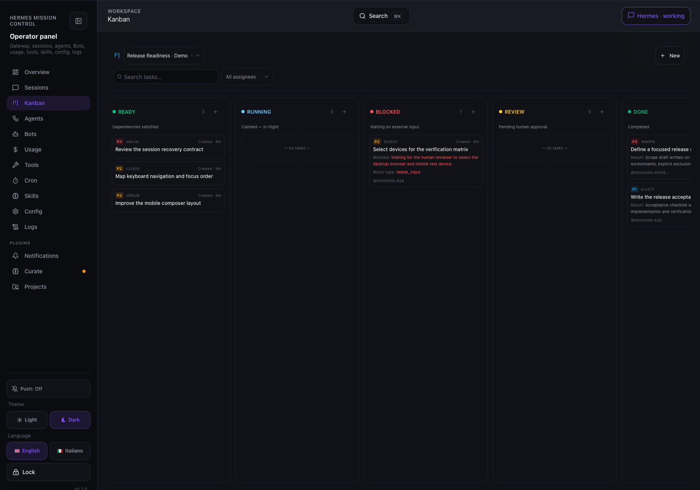

# Kanban

Mission Control includes a responsive Kanban board for operating Hermes task boards from the dashboard.

The feature is available from the **Kanban** route in the side navigation. It supports desktop and mobile layouts and reuses the Hermes core `kanban_db` implementation through the local telemetry sidecar. Mission Control does not duplicate the task database or dispatcher logic.

## In action



*The release-readiness demo board separates queued planning work, an explicit `needs_input` blocker, and completed scope/checklist deliverables. No worker is shown running.*

The board scrolls horizontally: this screenshot preserves one full application viewport, not all eight columns at once. The completed cards represent authored planning documents, not implemented features or passing tests.

## Capabilities

- Eight workflow columns: `triage`, `todo`, `scheduled`, `ready`, `running`, `blocked`, `review`, and `done`
- Board picker with the current CLI/gateway board indicator
- Create boards with:
  - slug (lowercase, hyphen-separated identifier)
  - display name
  - description
  - project directory (`default_workdir`)
  - icon or emoji
  - optional switch-to-board behavior
- Archive boards or permanently delete them after confirmation
- Protection for the default board and the last remaining board
- Create tasks with:
  - target column
  - title and description
  - specifier/assignee
  - priority
  - comma-separated skills
  - workspace kind (`scratch`, `worktree`, or `dir`)
  - workspace path
  - optional parent task
  - goal mode
- Drag and drop tasks between columns with optimistic UI and rollback on failure
- Task drawer with task details and comments
- Operational task inspector with:
  - result/final summary
  - child task relationships
  - run history (profile, outcome, elapsed time, summaries, errors)
  - event/activity timeline with structured payloads
  - bounded worker log tail
  - status actions (ready, block, complete, archive)
  - assignee and priority editing
  - parent dependency linking and unlinking
- Search by task title, ID, or assignee
- Tenant and assignee filters
- Live board refresh through event-tail polling
- Rich task cards with priority, short ID, relative age, assignee, progress, and comments

## Desktop and mobile behavior

- Desktop uses equal-width columns in a horizontally scrollable board.
- Mobile keeps the same column width so cards remain readable and the board scrolls horizontally instead of compressing into unusable slivers.
- Creation and confirmation dialogs become bottom sheets on mobile.
- Dialogs have internal scrolling and safe-area padding for iOS.
- Form inputs use a mobile-safe font size to avoid Safari auto-zoom.
- Custom dropdowns share the board picker interaction pattern: visible chevron, selected-item indicator, outside-click dismissal, and upward opening inside constrained dialogs.

## Architecture

The frontend calls the sidecar endpoints under `/api/local/kanban/*`:

| Endpoint | Purpose |
|---|---|
| `GET /api/local/kanban/boards` | List boards and current-board state |
| `GET /api/local/kanban/board` | Load the active board and columns |
| `GET /api/local/kanban/tasks/:id` | Load task details, comments, runs, and events |
| `GET /api/local/kanban/tasks/:id/log` | Read the task run log (`tail` query parameter) |
| `GET /api/local/kanban/events` | Read board events after a cursor |
| `POST /api/local/kanban/boards` | Create a board |
| `POST /api/local/kanban/boards/:slug/switch` | Switch the CLI/gateway board |
| `POST /api/local/kanban/boards/:slug/delete` | Archive or permanently delete a board |
| `POST /api/local/kanban/tasks` | Create a task |
| `POST /api/local/kanban/tasks/:id` | Update a task; move it between columns with `{"status": "<column>"}` |
| `POST /api/local/kanban/tasks/:id/archive` | Archive a task |
| `POST /api/local/kanban/tasks/:id/links` | Link or unlink a parent task (`{"parent_id", "remove"}`) |
| `POST /api/local/kanban/tasks/:id/comments` | Add a comment |

Every route accepts an optional `?board=<slug>` query parameter.

The bridge delegates database and task lifecycle operations to the Hermes core `kanban_db`. Orchestration settings remain in the Hermes core configuration and dashboard; Mission Control deliberately does not duplicate that settings panel.

## Testing

The bridge tests use an isolated temporary `HERMES_HOME` and the real Hermes core checkout. They run locally with the core virtual environment:

```bash
~/.hermes/hermes-agent/venv/bin/python -m pytest tests/test_kanban_bridge.py -q
```

CI skips these host-dependent bridge tests when the Hermes core checkout is unavailable, while still running the remaining Python tests and the frontend build.
