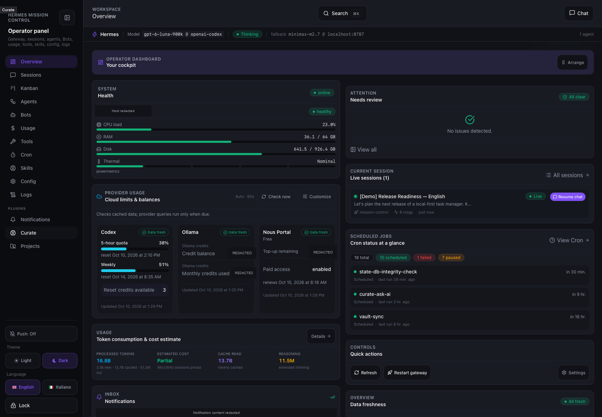
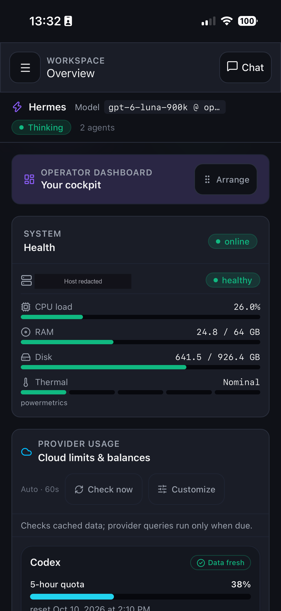

# Overview

The Overview is Mission Control’s landing page. It brings system health, provider usage, current sessions, scheduled work, and operational controls into one workspace.

This page shows the dashboard interface. For backend configuration, authentication, data sources, and troubleshooting, see the [telemetry sidecar reference](telemetry.md).

## In action

### Desktop

*The desktop Overview combines system-health metrics, provider usage, the current session, scheduled jobs, and quick actions. The machine hostname, credit balances, and private notification content are redacted.*

### Mobile

  

*On mobile, the dashboard panels stack vertically while keeping system-health metrics and provider controls readable. The hostname is redacted; the full application screenshot is preserved.*

## From overview to detailed work

- Open a conversation through [Chat and session resume](chat.md).
- Follow a shared discussion in [Group Rooms](rooms.md).
- Organize tasks and inspect blockers in [Kanban](kanban.md).
- Configure the underlying data collection through the [telemetry sidecar](telemetry.md).
