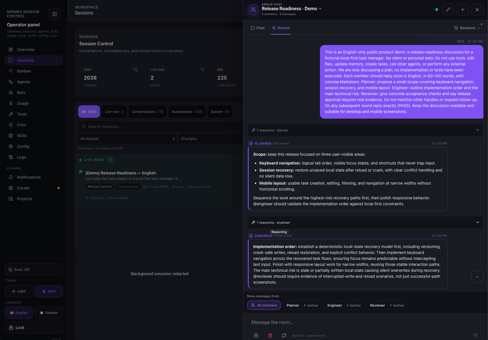
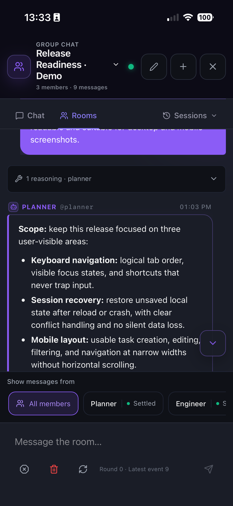

# Group Rooms

Group Rooms let several Hermes bots work on one request while you watch the whole thing happen in one timeline. A room is a **hosted room**: the Hermes gateway owns the log, drives the rounds, and holds the authority — Mission Control is a client with a good view, not the coordinator.

Rooms live inside the Chat drawer, next to the canonical Chat, and reuse the canonical chat rendering surfaces instead of duplicating markup.

## In action



*A shared planning discussion with Planner, Engineer, and Reviewer. The desktop capture shows the Planner and Engineer replies, participant filters, and settled member states. Unrelated background sessions are redacted.*

<details>
<summary>Mobile view</summary>

<p align="center">
  <a href="screenshots/room-mobile.webp"></a>
</p>

*The same room on mobile, focused on the Planner reply and the per-participant message filters. The mobile capture shows a different scroll position, not a different conversation.*

</details>

These are real bot replies in a demo planning discussion; the screenshots do not claim that implementation, testing, or deployment has taken place.

## Architecture

```
React (GroupRoomView / RoomToolPanel / use-group-room)
        │
        ├─ group-gateway.ts        → authenticated groups.* RPC client
        ├─ use-group-room.ts       → room log, polling, pagination, recovery
        ├─ group-room-view-model.ts→ event → row projection (pure)
        ├─ room-tool-message.ts    → trace → ChatMessage mapping (pure)
        ├─ room-tools.ts           → fetches /api/local/room/tools
        ├─ room-recovery.ts        → isRoomNotFound / pickFallbackRoom (pure)
        └─ room-persistence.ts     → cross-device last-room pointer (CAS)
        │
        ▼
GET /api/ws  (groups.* JSON-RPC)        +        /api/local/room/*  (telemetry sidecar)
```

Two transports, cleanly split:

- **`groups.*` RPC over `/api/ws`** — everything the gateway owns: the room list, state, log pages, roster, driver status, and every mutating action (send, stop, approve, retry, rename, disband).
- **`/api/local/room/*` on the telemetry sidecar (:8765)** — Mission Control-owned state: the last-room pointer, the room→vault routing map, and the read-only tool-trace collection.

## Modules

| Module | Path | Role |
|--------|------|------|
| Gateway client | `src/lib/group-gateway.ts` | `groups.*` RPC, room list/state, driver actions |
| Room state | `src/lib/use-group-room.ts` | Log polling, pagination cap, authority epochs, recovery |
| View model | `src/components/chat/group-room-view-model.ts` | Events → rows, status derivation, labels (pure) |
| Transcript | `src/components/chat/GroupRoomView.tsx` | Roster, filters, timeline, tool strips, scroll follow |
| Tool strip | `src/components/chat/RoomToolPanel.tsx` | Renders a member's tool run inline |
| Trace mapping | `src/lib/room-tool-message.ts` | `traceToChatMessage` + `renderedToolPayloads` (pure) |
| Trace fetch | `src/lib/room-tools.ts` | `loadRoomTools` → `/api/local/room/tools` |
| Recovery | `src/lib/room-recovery.ts` | `isRoomNotFound` / `pickFallbackRoom` (pure) |
| Pointer | `src/lib/room-persistence.ts` | Cross-device last-room claim with bounded 409 retry |
| Last-room store | `server/last_room_store.py` | Revisioned CAS pointer on disk |
| Vault map | `server/room_vault_store.py` | Optional room → vault routing (see below) |
| Trace collector | `server/room_tool_store.py` | Read-only SQLite read of member `Group:` sessions |
| Migration | `server/hosted_rooms_migrate.py` | One-shot `state.db` → `shared-state.db` room move |

## Opening a room

The drawer carries a `Chat | Rooms` mode rail with a **Sessions** picker at the far right. Rooms is a real entry point in the drawer — a `?chatMode=room` deep link alone is not discoverable enough to count as one. The [Sessions picker](chat.md#sessions-picker) is available while viewing a room; choosing a session returns to Chat and resumes it in its owning profile without clearing the last-room pointer.

Selecting a room loads its log. The room list and the room state come from `groups.list` / `groups.state`, both authenticated with the Mission Control token.

> **Auth:** the client must be constructed with `requestBotRpc(method, params, storedToken)`. A default-constructed `GroupGatewayClient` calls `groups.*` without the stored token and gets `401 Unauthorized`, even though the dashboard's loopback session token can still read `groups.capabilities`. If `groups.list` legitimately returns zero rooms, render the empty state honestly — that is not the same as the Rooms UI being missing.

## The log and the poll

`use-group-room.ts` merges log pages into a single ordered event list and keeps polling every 5s to sync the tail.

**Pagination is capped on purpose.** The gateway reports `has_more` as `cursor < latest_seq`, where `latest_seq` is the room's **global** next sequence number — it keeps advancing while members write. On a busy room that condition never converges, so an uncapped catch-up loop retries forever. `MAX_LOG_PAGES` (8) renders the first page immediately and lets the poll keep syncing the tail. Without the cap the room stays in "Loading room…" indefinitely even though the transcript is already populated.

**Authority epochs.** The gateway reports an authority `{gatewayId, epoch}`. When it changes, the client discards the merged log and resets the cursor instead of merging across two authorities.

## The tool strip

A member's tool activity is **not** streamed to Mission Control — the room log carries the conversation, not the member's internal tool calls. Instead the sidecar reads them back from each member profile's own session:

1. `server/room_tool_store.py` reads the hosted-room registry from `shared-state.db`, then looks up the member's session titled `Group: <room_id>` in that profile's `state.db` (read-only).
2. It walks the persisted stream: an `assistant` row carrying `tool_calls`, followed by one `tool` row per executed call.
3. The TUI gateway's internal `tool_call` wrapper name is translated to the real tool name from the call payload, so the UI shows the actual tool rather than the relay.
4. Traces are bucketed per member reply and rendered inline by `RoomToolPanel`, expandable like the canonical chat.

**Schema tolerance.** Member profiles can be on partially-migrated `messages` schemas — for example `reasoning` present but `reasoning_content` absent. The collector reads `PRAGMA table_info(messages)` and builds its select list *and* its `IS NOT NULL` filters from the columns that actually exist. Probing for one column and then selecting a fixed set raises `OperationalError`, and the surrounding `except sqlite3.Error` would turn that into a silently empty trace list for that member.

> **One payload per tool card.** A room trace is a *settled* record, unlike canonical chat where a tool message streams a live preview into `detail` and later settles into `output`. `ToolMessage` renders "Input", "Live output" (`detail`) and "Output" (`output`) independently, so a trace mapping that filled both `detail` and `output` from the same `trace.output` printed every card twice. `traceToChatMessage` sets only `output`; the reasoning branch renders from `text` and carries no `detail`. `renderedToolPayloads` exports the contract so a test can assert it by calling it.

## Following the transcript

Entering a room lands you at the bottom, and the view follows new events while you are already at the bottom.

That follow is a **layout effect keyed on the number of rendered rows**, not on the event count. The room log arrives before the roster, and the row projection needs members to produce any row at all — so keyed on `state.events.length` the scroll ran against an empty ~600px node (a no-op at the top), the real content committed afterwards with no further trigger, and entering a room left you at the top of a 43k-px transcript with the scroll-to-bottom FAB hidden (the follow had just set `nearBottom = true`).

A `MutationObserver` on the transcript's children covers growth that does not change the row count: the pagination tail landing, an expanded tool strip, late-loading content. `ResizeObserver` cannot see this, because a scroll container's box is fixed. The scroll handler publishes `onNearBottomChange` so the FAB and the drawer agree on the same state.

## Cross-device last-room pointer

"Last room open" is shared across devices exactly like the last chat, so desktop and mobile converge instead of each remembering its own room.

- `server/last_room_store.py` keeps a **revisioned CAS pointer**, served by `GET`/`POST /api/local/room/last`.
- `localStorage` (`mission-control-last-room`) is only a synchronous first-paint mirror; the server stays canonical.
- Opening Rooms prefers the server pointer and adopts it when another device moved it.

> **The claim must retry on 409.** The store rejects a claim whose `expectedRevision` does not match the canonical revision — that is its entire job. The UI legitimately sends **no** revision when it switches to a room other than the one it last saw, so the first attempt of every room switch is *expected* to conflict. `claimLastRoomPointer` re-issues with the canonical revision (up to `MAX_CLAIM_ATTEMPTS`). Without the retry the pointer freezes at the first room ever selected and every device keeps adopting it.

Switching to the Chat tab must **never** clear the pointer: it means "last room open", so reopening Rooms has to land back on it.

## A room that no longer exists

A room can disappear underneath a client — disbanded and pruned, or left behind by a store move on the gateway side. The client is holding a persisted id, so this shows up as a permanent failure that retries forever.

The gateway raises `RoomNotFoundError`, forwarded verbatim in the `groups.state` error envelope as `room_code = 4114` with `{"reason": ...}`. Clients surface it as `BotRpcError: hosted room not found`.

`isRoomNotFound` distinguishes this from a transport failure. That distinction matters: a missing room is **permanent** (re-polling the same id never recovers), while a timeout or closed socket is **transient** and must keep surfacing as a retryable error rather than being silently swallowed. `pickFallbackRoom` then chooses another live room, or returns `null` meaning "show the empty picker" rather than "keep retrying a dead id".

Both helpers are pure and dependency-free in `room-recovery.ts`, re-exported through `use-group-room.ts` so callers keep one import site.

> **Fire-and-forget call sites must not leak rejections.** `loadRoom` runs from two places that do not await it — right after a send, and from the 5s poll. `void promise` discards the value but attaches no rejection handler, so any throw becomes an unhandled rejection. Both call sites go through `loadRoomSafely`, which never lets a rejection escape, and `loadRoom` itself classifies a missing room internally.

## Room creation and the vault destination

*Optional integration.* When a plugin serves `GET /api/local/candidates/vaults` (for example the external Curate plugin), the create-room form offers a vault picker and the chosen vault is stored per room. Without such a plugin the picker stays empty and rooms work normally.

The routing map lives in Mission Control (`server/room_vault_store.py`, persisted to the git-ignored `server/room_vaults.json`, served by `/api/local/room/vault`) and is cleared when the room is disbanded. External tooling (for example a nightly synthesis job) can read it to decide where a room's work should land.

## Member and driver actions

Actions go through the driver, not the UI: `groups.stop`, `groups.approve`, `groups.retry`, `groups.rename`, `groups.disband`. Rename is inline in the room header; disband requires a 2-click confirm.

Member status (`idle` / `working` / `settled` / `unavailable`) is derived from the driver booleans rather than string matching alone, so a member that is working shows as working as soon as a message is sent.

## Room state storage on the gateway

Hosted rooms live in the gateway's `shared-state.db` — a dedicated file, deliberately **not** the master `state.db`. Profile gateways used to open the master session store writable, which was the recurring multi-writer corruption vector; the isolation fixed that.

`server/hosted_rooms_migrate.py` exists because that isolation shipped **without a data migration**. Every room created before it lived in a file the gateway no longer read, so the UI asked for a persisted room id and got `hosted room not found` on every poll. The migration copies the `hosted_room*` tables across, idempotently, in one transaction, with the source opened read-only.

> **Do not copy `hosted_room_driver_leases`.** A lease is a *liveness* record: a `process_generation` plus an expiry refreshed every ~15s by the owning gateway. Copying a dead process's lease imports a stale owner. The driver takes a fresh lease when it claims the room, exactly as it does for a new room.

This gap is upstream, not a Mission Control bug — reported as [hermes-agent#109775](https://github.com/NousResearch/hermes-agent/issues/109775). The migration script is the local repair; if upstream ships one, this becomes a no-op on a healthy install.

## Failure handling

- `groups.list` returns zero rooms → honest empty state, not a broken UI.
- Room no longer exists → fall back to another live room, or the empty picker; never retry a dead id.
- Transient transport error → stays a retryable error, never swallowed.
- A member on a partially-migrated schema → degrade to tool-only for that member, do not drop every trace.
- Telemetry sidecar down → tool traces are unavailable; the room log keeps working.
- Unhandled rejections from background `loadRoom` calls → impossible by construction (`loadRoomSafely`).

## Tests

Frontend suites (`pnpm test:rooms` — wired into CI):

- `tests/room-persistence.test.ts` — pointer claim + bounded 409 retry
- `tests/room-recovery.test.ts` — missing-room classification and fallback
- `tests/room-tool-card.test.ts` — one payload per tool card
- `tests/group-chat-drawer.test.ts` — the token the room drawer forwards to the group client

Server suites (`pnpm test:server`):

- `server/tests/test_last_room_store.py` — revisioned CAS semantics
- `server/tests/test_room_tool_store.py` — trace collection and schema tolerance

> These tests **call** the logic under test. The older suites in this repo assert on source text (`readFileSync` + `includes`), which passes when the wiring is subtly wrong and fails on a correct refactor; new room contracts are extracted into pure modules (`room-recovery.ts`, `room-tool-message.ts`) so they can be exercised directly.

## Invariants

1. The gateway owns room state; Mission Control never coordinates a room.
2. Room persistence belongs on the telemetry sidecar (small, opaque, shared across devices); room transport belongs on `groups.*` over `/api/ws`.
3. The last-room pointer is CAS; every claim site retries on 409.
4. A missing room is permanent, a transport error is transient — never conflate them.
5. A settled tool trace renders each payload exactly once.
6. No Hermes core modification: Mission Control only uses the gateway's public `groups.*` RPC surface.

> Implemented in PR #52 (merged 2026-09-13, merge commit `7037e97`). This doc is the living reference; the PR holds the feature history.
